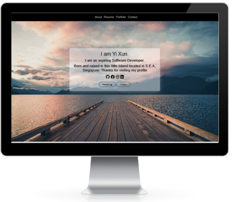

# Portfolio

* A layout of my portfolio

### Github Repository
- [Portfolio](https://github.com/xunne899/portfolio) 

### Live Demo
-  [Live Demo](https://tech-talent-22.herokuapp.com/)

# Summary
A simple portfolio single-page

* Navbar Tab consists of About, Resume, Portfolio, Contact.Upon clicking will link users to the respective section of the single page
* Single page - There is a Box in the middle of the page with a brief introduction of myself. Upon clicking on the resume button, users are able to download the resume pdf version. Various social media icons in the box are able to link users to the respective webpage upon clicking.
* Users are able to click on the various pop up icon under different section of the single page application. It will link users to web page under a new tab.